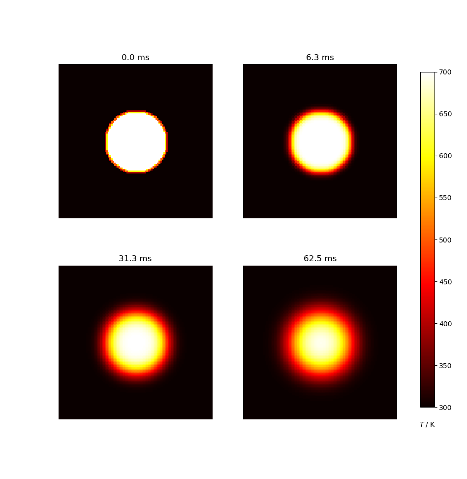

# Diffusion2D-Python-Package



## Project description

This code solves the diffusion equation in 2D over a square domain which is at a certain temperature and a circular disc at the center which is at a higher temperature.
This code solves the diffusion equation using the Finite Difference Method.
The thermal diffusivity and initial conditions of the system can be changed by the user.
The code produces four plots at various timepoints of the simulation.
The diffusion process can be clearly observed in these plots.

## Installing the package

### Using pip3 to install from PyPI

To install this package, simply run `pip install hauschmxdiffusion2D`.

### Required dependencies

This project requires the following dependencies:
- numpy
- matplotlib

## Running this package

To run the simulation you can either import the `solver` function or run it interactively.

To import it in your code do the following:

```python
from hauschmxdiffusion2D import diffusion

diffusion.solver(dx=.1, dy=.1, D=4.)
```

Using the interactive shell:
```python
Python 3.8.11 (default, Jun 28 2021, 10:57:31)
[GCC 10.3.0] on linux
Type "help", "copyright", "credits" or "license" for more information.
>>> from hauschmxdiffusion2D import diffusion2d
>>> diffusion2d.solve()
```

## Citing
